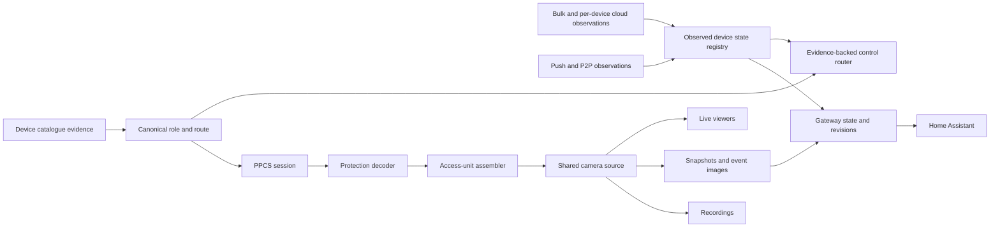
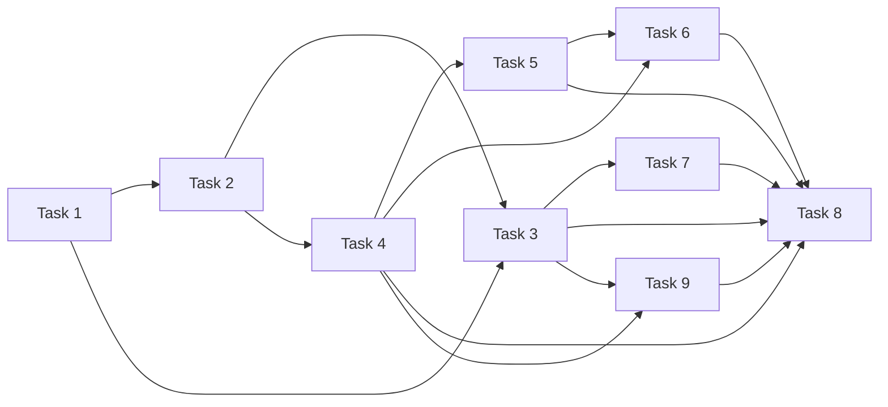

# Eufy protocol and state foundation

> Replace issue-specific patches with one media, topology, state, and control architecture that fixes shared causes without trading one device regression for another.

## Problem and outcome

The 18 open reports do not represent 18 independent defects. They cluster around four shared boundaries: PPCS media framing and protection, stream ownership across consumers, device role and route resolution, and source-aware device state. The current implementation spreads those decisions across the provider, PPCS session, stream manager, cloud inventory refresh, and Home Assistant entity code. A local correction in one layer can therefore make one device appear fixed while breaking another topology or leaving stale state elsewhere.

This plan establishes one contract at each boundary. Complete authenticated media units feed a generation-safe shared source. A canonical device route feeds both media and controls. An observed-state registry reconciles cloud and realtime evidence. Home Assistant consumes those stable contracts and retained-media revisions. The release gate then proves the combined behaviour across supported topologies before any public claim or development-app cleanup.

Planning evidence is based on `origin/main@8157a20ca804233cb81047bb8fd88f6d1888213f` and the open-issue audit completed on 2026-09-20. The local working branch is behind that snapshot, so implementation must begin from a fresh branch based on current `origin/main`.

## Scope

### Included

- Reassembly of complete PPCS media access units before normalisation or consumption.
- Clear, RSA, and authenticated ECC media decoding for direct and attached routes.
- One generation-safe camera source shared by viewers, snapshots, recordings, and warm-up.
- Canonical device role, station ownership, channel, route, and capability evidence.
- Source-aware state reconciliation for camera enabled state, battery, and later controls.
- Readback-backed camera enablement, proven siren routes, and conservative privacy and battery entities.
- Immediate retained-image revision propagation to the existing Home Assistant camera entity.
- A split streaming harness that tests known cameras at the gateway boundary and Home Assistant separately at its adapter boundary.
- One cross-topology release gate, evidence-limited issue follow-up, and post-release development-app removal.

### Excluded

- Guessing unsupported commands, parameter polarity, model identity, or battery calibration from adjacent devices.
- Persisting observed device state across gateway restarts.
- Replacing the existing camera entity with a separate retained-image entity.
- Claiming hardware resolution from unit tests, inventory admission, route readiness, or release publication alone.
- Closing #64 or other hardware reports without reporter confirmation.

## Requirements

- [ ] No media consumer receives an incomplete or unauthenticated access unit.
- [ ] Direct and attached devices use explicit protection and route evidence without topology-specific fall-through.
- [ ] One source generation owns its decoder, assembler, timers, leases, callbacks, and teardown.
- [ ] Device admission, media, controls, and diagnostics consume one canonical role and route result.
- [ ] Missing state remains unknown and older observations cannot overwrite fresher authoritative state.
- [ ] Every exposed control has an evidence-backed command route and readback contract.
- [ ] Retained image revisions invalidate the existing camera image URL after atomic commit.
- [ ] Known-camera gateway streaming and Home Assistant adapter behaviour can be tested independently.
- [ ] First view, repeat view, snapshot, recording, cancellation, and implemented controls pass the topology matrix.
- [ ] Public issue updates distinguish code availability from reporter-confirmed hardware success.
- [ ] The development app is stopped and deleted only after the live product release and health checks complete.

## Current-system evidence

| Fact | Evidence |
|---|---|
| Media acceptance currently depends on a decoded frame starting with Annex B | `eufy_event_gateway/src/stream/first-party-ppcs.ts:161` |
| Each command 1300 frame is currently normalised and written independently | `eufy_event_gateway/src/stream/first-party-ppcs.ts:798` |
| Direct routes do not receive the attached gateway-info cipher path | `eufy_event_gateway/src/provider/eufy-provider.ts:146` and `eufy_event_gateway/src/stream/first-party-ppcs.ts:855` |
| Stream consumers and FFmpeg are owned by `LiveStreamManager`, while provider sessions are owned separately | `eufy_event_gateway/src/stream/live-stream-manager.ts:21` and `eufy_event_gateway/src/provider/eufy-provider.ts:146` |
| Route inference is reconstructed from parent serials inside the provider | `eufy_event_gateway/src/provider/eufy-provider.ts:1060` |
| Device refresh rebuilds readings from bulk inventory | `eufy_event_gateway/src/provider/eufy-provider.ts:506` |
| Camera enablement is exposed only when state and route are currently available | `eufy_event_gateway/src/provider/eufy-provider.ts:527` |
| Snapshot storage already commits atomically with a monotonic revision | `eufy_event_gateway/src/storage/snapshot-store.ts:68` |
| Home Assistant rotates its camera image token from stream-state transitions rather than every retained revision | `custom_components/eufy_event_gateway/camera.py:90` |

## Target shape

## Decisions

### Settled

| Decision | Choice and rationale | Encoded in |
|---|---|---|
| Media boundary | Decode each transport chunk, then assemble complete access units. Annex B presence is not a decryption test and a continuation need not contain a start code. | `tasks/01-reassemble-complete-media-access-units.md` |
| Protection ownership | A dedicated decoder owns clear, RSA, ECC, authentication, and per-stream key lifetime. It never downgrades failed authentication to clear media. | `tasks/02-make-media-protection-topology-neutral.md` |
| Source ownership | One camera source generation owns provider callbacks and serves every active consumer through leases. | `tasks/03-unify-shared-camera-source-lifecycle.md` |
| Route ownership | One resolver produces role, topology, station, channel, and readiness. Consumers do not re-infer them. | `tasks/04-resolve-device-role-and-route-once.md` |
| State precedence | Values retain source and observation time. Missing data remains unknown and newer authoritative evidence replaces stale overlays. | `tasks/05-build-observed-device-state-registry.md` |
| Control exposure | Entity support requires device-role evidence, a routed command, and trustworthy readback. Similar model names do not grant capabilities. | `tasks/06-route-evidence-backed-device-controls.md` |
| Retained images | The existing camera entity reacts to atomic retained revision changes. No second image entity is introduced. | `tasks/07-propagate-retained-image-revisions.md` |
| Test boundaries | Known-camera protocol runs, deterministic Home Assistant adapter tests, and optional product wiring smoke are separate evidence classes. | `tasks/09-build-split-streaming-test-harness.md` |
| Release cleanup | Production release and health are verified before the development app is stopped and deleted. Production health is checked again afterwards. | `tasks/08-run-cross-topology-release-gate.md` |

## Delivery tasks

| Task | Outcome | Depends on | Status |
|---|---|---|---|
| [01 Reassemble complete media access units](tasks/01-reassemble-complete-media-access-units.md) | Complete decoded access units replace per-chunk output | None | Ready |
| [02 Make media protection topology-neutral](tasks/02-make-media-protection-topology-neutral.md) | Direct and attached protection use one authenticated decoder | 1 | Ready |
| [03 Unify the shared camera source lifecycle](tasks/03-unify-shared-camera-source-lifecycle.md) | One generation-safe source serves every media consumer | 1, 2 | Ready |
| [04 Resolve device role and route once](tasks/04-resolve-device-role-and-route-once.md) | One canonical decision feeds admission, media, controls, and diagnostics | 2 | Ready |
| [05 Build an observed device state registry](tasks/05-build-observed-device-state-registry.md) | Cloud and realtime values reconcile by source and freshness | 4 | Ready |
| [06 Route evidence-backed device controls](tasks/06-route-evidence-backed-device-controls.md) | Only proven, readable controls and batteries reach Home Assistant | 4, 5 | Ready |
| [07 Propagate retained image revisions](tasks/07-propagate-retained-image-revisions.md) | Event and live images refresh on the existing camera entity | 3 | Ready |
| [08 Run the cross-topology release gate](tasks/08-run-cross-topology-release-gate.md) | The combined release is proven, published, and cleaned up safely | 3, 4, 5, 6, 7, 9 | Draft |
| [09 Build the split streaming test harness](tasks/09-build-split-streaming-test-harness.md) | Known-camera gateway runs and Home Assistant adapter tests stay separate | 1, 2, 3, 4 | Ready |

Task 1 is the first reviewable implementation slice. It restores the transport boundary required by every later media change without altering routing, cloud state, Home Assistant contracts, or release state. Task 9 should follow the first media and route contracts so that every later release gate can identify whether a failure belongs to Eufy transport, the Home Assistant adapter, or their wiring.

## Cross-surface obligations

| Surface | Required outcome |
|---|---|
| Gateway media | Authenticate, reassemble, and lifecycle-manage media before any consumer receives it |
| Provider and cloud | Resolve device routes once and reconcile state without hiding unknown or stale values |
| Home Assistant | Consume stable state and revision contracts, and expose only evidence-backed entities |
| Test automation | Keep direct gateway streaming, fake-gateway adapter tests, and deployed end-to-end smoke results separate |
| Diagnostics and support | Report structural outcomes without payloads, secrets, serials, peer endpoints, or unsupported success claims |
| Documentation | Describe architecture boundaries and update the supported capability matrix only from verified evidence |
| Release and operations | Synchronise release artefacts, pass hosted checks, verify the live product, then remove development safely |

## Verification strategy

Each task starts with deterministic unit fixtures around its contract, then adds integration tests at the neighbouring boundary. The media tasks share synthetic clear, RSA, and authenticated vectors, including split units and stale generations. Routing and state tests cover direct, attached, missing-parent, owner-only, stale-value, and unknown-value cases. Task 9 adds three explicit evidence classes: direct known-camera gateway streams, deterministic Home Assistant adapter tests against a fake gateway, and optional deployed end-to-end smoke. Home Assistant tests cover entity gating, readback, retained revisions, and coordinator behaviour. The final gate runs the full local and hosted suites as one candidate, then records available hardware evidence separately for first view, repeat view, snapshot, clip, cancellation, events, and controls. Release publication, downloadable artefact, production health, and development-app removal remain separate verified steps.

## Risks and open questions

| Severity | Risk | Mitigation or owner and trigger |
|---|---|---|
| High | A framing repair emits unauthenticated or partial bytes | Task 1 assembles only after successful per-chunk decoding, and Task 2 rejects failed authentication before assembly |
| High | Old source callbacks tear down a replacement stream | Task 3 gives every timer, callback, and retained frame an explicit generation owner |
| High | A broad catalogue entry grants controls to an adjacent device | Tasks 4 and 6 require separate role, route, command, and readback evidence |
| High | Stale cloud state overwrites a realtime device change | Task 5 records source and observation time and tests precedence and expiry |
| High | Development cleanup affects the live product or persistent data | Task 8 resolves the exact runtime target, verifies production first, removes only development, and checks production again |
| Medium | T8224 model and numeric-type evidence remain contradictory | Device catalogue owner records both values without renaming the device. Resolve when a redacted structural inventory sample confirms the model, type, and route shape |
| Medium | Privacy mode has no trustworthy readable state or polarity | Gateway owner keeps the switch absent. Resolve after repeated app transitions produce one stable observed parameter and readback behaviour |
| Medium | Some device fixes cannot be proven locally | Release owner marks code paths as available while the issue stays open for reporter hardware confirmation |

**OPEN: Which stable readable parameter and polarity represent privacy mode on T8416? | owner: gateway and hardware reporter | trigger: repeated app transitions produce a consistent observed value.**

**OPEN: Does the reported T8224 and type 96 combination represent a catalogue mismatch or a distinct route shape? | owner: device catalogue | trigger: redacted structural inventory confirms model, numeric type, parent relationship, and credential shape.**
